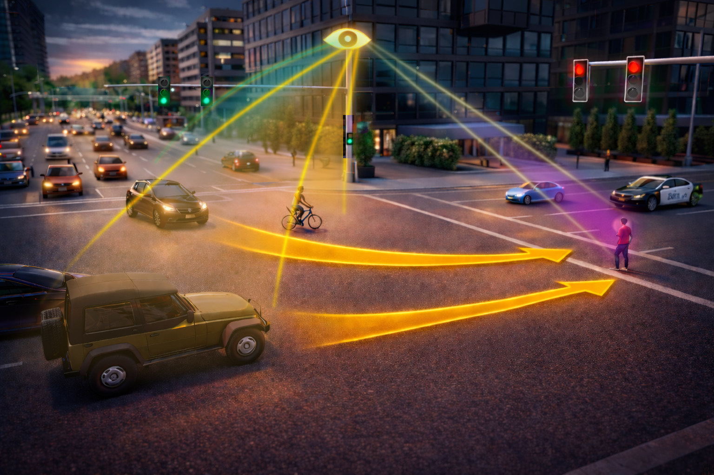

# MSight: Digital Infrastructure for Roadside Intelligence

## Overview

**MSight** is an open-source, full-stack digital infrastructure for roadside intelligence, developed by University of Michigan Transportation Research Institute (UMTRI). It enables real-time perception, tracking, prediction, and communication for transportation systems by integrating multi-sensor data streams with scalable edge–cloud architecture.

MSight is designed to serve as a foundational platform for next-generation transportation applications, including:

* 🚗 Cooperative perception (CP)
* ⚠️ Near-miss and conflict detection
* 📡 V2X communication and safety messaging
* 🧠 AI-driven traffic understanding and prediction


<p align="center">
  
</p>


For more details, visit:

* 🌐 Official Website: [https://msight.um.city/](https://msight.um.city/)
* 📚 Documentation: [https://msight-user-docs.readthedocs.io/en/latest/](https://msight-user-docs.readthedocs.io/en/latest/)

---

## Architecture

MSight follows a modular, multi-repository architecture to support scalability, flexibility, and independent development of components.

This repository serves as the **entry point** ("front door") and integrates the core modules as submodules.

---

## Core Modules

### 🧱 [MSight_base](./MSight_base)

Provides the **fundamental data abstractions and utilities** for MSight's digital infrastructure.

Key features:

* Standardized object definitions: road users, points, trajectories, frames
* Data containers and lifecycle management
* Trajectory management system
* Visualization utilities for debugging and analysis

This layer defines the **canonical data schema** used across all MSight modules.

---

### ⚙️ [MSight_Core](./MSight_Core)

Implements the **distributed system backbone** for real-world, scalable edge deployments.

Key features:

* Node-based execution framework
* High-performance pub/sub communication
* Data serialization and transport
* Pipeline orchestration
* Edge–cloud integration support

This layer enables **low-latency, production-grade deployment** of MSight systems.

---

### 🎥 [MSight_Vision](./MSight_Vision)

Handles **2D sensor processing**, focusing on camera-based perception.

Supported sensors:

* RGB cameras
* Fisheye cameras
* Infrared cameras

Key features:

* Object detection pipelines
* Multi-camera processing
* Integration with downstream tracking and fusion modules

This module serves as the **visual perception front-end** of MSight.

---

### 🛰️ MSight_Lidar (🚧 Coming Soon)

This module will provide:

* 3D perception using LiDAR
* BEV-based fusion capabilities
* Integration with MSight_Core and MSight_base

> ⚠️ This repository is currently under development and not yet available.

---

## Getting Started

Clone the repository with submodules:

```bash
git clone --recurse-submodules https://github.com/<your-org>/MSight.git
```

If you already cloned without submodules:

```bash
git submodule update --init --recursive
```

---

## Design Philosophy

MSight is built around several core principles:

* 🧩 **Modularity** — Each component is independently developed and maintained
* ⚡ **Real-time performance** — Optimized for low-latency edge deployment
* 🌍 **Scalability** — From single intersections to city-scale systems
* 🔗 **Interoperability** — Standardized data schemas and interfaces

---

## Contributing

We welcome contributions from the community. Please refer to individual submodules for contribution guidelines.

---

## License

This project is licensed under the [BSD 3-Clause License](./LICENSE).

Copyright (c) 2026, University of Michigan Transportation Research Institute (UMTRI), University of Michigan.

---

## Acknowledgements

Developed by the University of Michigan Transportation Research Institute (UMTRI), University of Michigan.

Main developers: Rusheng Zhang

---

## Notes

* This repository uses Git submodules. Make sure to clone with `--recurse-submodules`.
* Do not remove or ignore submodule directories.
