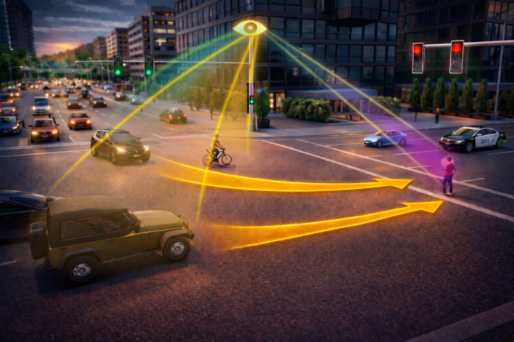

# MSight: Digital Infrastructure for Roadside Intelligence

## Overview

**MSight** is an open-source, full-stack digital infrastructure for roadside intelligence, developed by University of Michigan Transportation Research Institute (UMTRI). It enables real-time perception, tracking, prediction, and communication for transportation systems by integrating multi-sensor data streams with scalable edge–cloud architecture.

MSight is designed to serve as a foundational platform for next-generation transportation applications, including:

* 🚗 Cooperative perception (CP)
* ⚠️ Near-miss and conflict detection
* 📡 V2X communication and safety messaging
* 🧠 AI-driven traffic understanding and prediction


<p align="center">
  
</p>


For more details, visit:

* 🌐 Official Website: [https://msight.um.city/](https://msight.um.city/)
* 📚 Documentation: [https://msight-user-docs.readthedocs.io/en/latest/](https://msight-user-docs.readthedocs.io/en/latest/)

---

## Architecture

MSight follows a modular, multi-repository architecture to support scalability, flexibility, and independent development of components.

This repository serves as the **entry point** ("front door") and integrates the core modules as submodules.

The stack spans three tiers, each doing real computation, that meet at well-defined seams:

* **Roadside (edge)** — `MSight_base` defines the data, `MSight_Vision` / `MSight_Lidar` produce it, and `MSight_Core` runs the on-device processing graph and forwards results upstream.
* **Cloud** — `MSight_Cloud` ingests those streams and *processes* them: decoding standard message formats, reassembling and filtering them, matching them against roadway geometry and live client positions, and turning them into events. It then serves the results — raw or derived — to applications, and hosts the microservices that implement application-specific logic.
* **Client (device)** — `MSight_APP_Client_Library` is the other end of that connection. It runs on phones, in-vehicle head units, and tablets: it holds the link to the cloud, reports where the device is, and turns what arrives into typed events an application can render.

```
  cameras · LiDAR · radar · signal controller
              │
              ▼
      roadside device                     cloud                        device
  ┌──────────────────────┐      ┌───────────────────────┐      ┌─────────────────────┐
  │ MSight_Vision        │      │     MSight_Cloud      │      │ MSight_APP_         │
  │ MSight_Lidar         │      │                       │      │   Client_Library    │
  │   ↓  fusion/tracking │      │ per-sensor pipeline:  │      │                     │
  │ (MSight_base objects)│      │  decode · reassemble  │ push │ connect · reconnect │
  │   ↓                  │ push │  filter · geo-match   ├─────▶│ report position     │
  │ MSight_Core          ├─────▶│ user microservices    │      │ approach detection  │
  │  buffer · aggregate  │      │ maps · SPaT · warnings│◀─────┤ typed event stream  │
  │  serialize · forward │      │ archival · query      │ loc  └──────────┬──────────┘
  └──────────────────────┘      │ admin console / MCP   │                 ▼
                                └───────────────────────┘    Android · iOS · IVI · desktop
```

### How the pieces connect

* **`MSight_base` is the contract.** Road users, trajectories, and frames are defined once and used unchanged by the perception modules, by `MSight_Core`'s transport layer, and by the payloads `MSight_Cloud` ingests — so edge and cloud never disagree about what a detection means.
* **`MSight_Core` is the edge-to-cloud bridge.** Its cloud-forwarding nodes publish real-time streams into the topics `MSight_Cloud` provisions per sensor, while its buffering, sorting, and aggregation nodes batch non-real-time data for upload into cloud-managed storage. Nothing on the device talks to the cloud directly; it all goes through `MSight_Core` nodes.
* **`MSight_Cloud` continues the processing pipeline off the device.** Each roadside stream is registered as a logical *sensor* with its own ordered queue and its own dedicated, long-running consumer — so streams scale and fail independently, and each one can hold warm state. Those consumers do substantive work: decoding SAE J2735 payloads (SDSM, SPaT), reassembling fragmented transmissions into a single object list, suppressing updates that are not safety-significant, resolving intersection geometry, and matching detections against the live, geo-indexed positions of connected clients.
* **`MSight_Cloud` provides the common functionality applications would otherwise each rebuild.** Client location registration with radius queries, intersection MAP lookup by position, real-time SPaT, radius-scoped notification, latency probing, and durable archival with query access are all first-class platform services rather than per-project code.
* **Mobile devices are first-class clients, not just data sinks.** A phone or on-board unit registers its position and holds a WebSocket connection, then receives — at low latency and scoped to where it actually is — either raw sensor streams forwarded from the roadside or events the cloud derived from them, such as conflict warnings and current signal state.
* **`MSight_APP_Client_Library` closes the loop on the device.** It is the only module that runs off-infrastructure, and it talks solely to `MSight_Cloud` over HTTPS — never to roadside devices. It holds the connection and reconnects through the dropouts a moving vehicle takes for granted, reports the position the cloud needs in order to scope pushes, and hands the application one typed event stream. It also does device-side processing of its own: matching position and heading against MAP lane geometry to work out which approach the driver is on, and resolving that against the latest SPaT into a plain answer — what colour is my light.
* **Application logic runs in the cloud too.** `MSight_Cloud` can build and run containerized microservices straight from a GitHub repository, on managed compute it provisions and scales, so custom algorithms consuming sensor streams and emitting events are deployed into the platform rather than bolted alongside it.
* **Operations run from the cloud.** The admin console and MCP server are where sensors are registered, streaming and archival settings are changed, microservices are deployed and rolled back, and fleet health, logs, and cost are inspected — the roadside modules are configured rather than individually administered.

---

## Core Modules

### 🧱 [MSight_base](https://github.com/michigan-traffic-lab/MSight_base)

Provides the **fundamental data abstractions and utilities** for MSight's digital infrastructure.

Key features:

* Standardized object definitions: road users, points, trajectories, frames
* Data containers and lifecycle management
* Trajectory management system
* Visualization utilities for debugging and analysis

This layer defines the **canonical data schema** used across all MSight modules.

---

### ⚙️ [MSight_Core](https://github.com/michigan-traffic-lab/MSight_Core)

Implements the roadside **distributed system backbone** for real-world, scalable edge deployments.

Key features:

* Bag of Nodes framework
* High-performance pub/sub communication
* Data serialization and transport
* Deployment tools for edge system

This layer enables **low-latency, production-grade deployment** of MSight systems.

---

### 🎥 [MSight_Vision](https://github.com/michigan-traffic-lab/MSight_Vision)

Handles **2D sensor processing**, focusing on camera-based perception.

Supported sensors:

* RGB cameras
* Fisheye cameras
* Infrared cameras

Key features:

* Object detection pipelines
* Multi-camera processing
* Integration with downstream tracking and fusion modules

This module serves as the **visual perception front-end** of MSight.

---

### ☁️ [MSight_Cloud](https://github.com/michigan-traffic-lab/msight-cloud)

Provides the **cloud processing and service platform** that coordinates with MSight roadside devices. The entire stack — networking, compute, storage, and the API surface — is defined as AWS CDK (TypeScript) and deploys into your own AWS account.

Key features:

* **Per-sensor stream processing** — every registered sensor gets its own ordered (FIFO) queue and its own long-running consumer, which decodes SAE J2735 payloads, reassembles fragmented transmissions, filters non-significant updates, and geo-matches detections against nearby clients
* **Deployable microservices** — build and run containerized application logic directly from a GitHub repository on managed, autoscaled compute, so custom cloud-side algorithms live inside the platform
* **Real-time delivery to mobile devices** — location-aware WebSocket streams carrying either raw sensor data or cloud-derived events, scoped to where each client is
* **Common connected-vehicle services** — intersection MAP lookup, real-time SPaT streaming, radius-scoped warning broadcast, client location registry, latency probing
* **Data management** — archival of aggregated sensor uploads, with a spatial database for maps, sensor and app registries, and query access
* **APIs and operations** — public client API with live OpenAPI docs, Cognito-protected admin API, an MCP server for AI-assisted operations, and a web admin console

This layer is the **cloud counterpart to `MSight_Core`**: the processing graph continues off the device, and what the roadside forwards, `MSight_Cloud` interprets, enriches, stores, and serves.

---

### 📱 [MSight_APP_Client_Library](https://github.com/michigan-traffic-lab/MSight_APP_Client_Library)

Provides the **client SDK for mobile and in-vehicle devices** — a Kotlin Multiplatform library that puts live roadside intelligence on the devices road users actually carry: a phone in a cup holder, an infotainment head unit, a tablet on a bus dashboard.

Key features:

* **Managed cloud connection** — discovers the WebSocket endpoint, reconnects with exponential backoff, and reports the device position that `MSight_Cloud` uses to scope what it pushes back
* **Typed event stream** — one hot `SharedFlow` of one sealed event hierarchy: SDSM detections, routine and phase-change SPaT, warnings, and the device's own location. No WebSocket handler, J2735 parser, or reconnection loop to write
* **On-device signal state** — flattens J2735 MAP lane geometry, infers which movements each signal group governs, matches position and heading to the approach the device is on, and resolves it against the latest SPaT into the answer a driver wants: *is my light red, yellow, or green?*
* **Cooperative perception on a consumer device** — every vehicle and pedestrian a roadside sensor can see, including those occluded from the driver's own view
* **Portable by construction** — all protocol handling, geometry, and state machines live in `commonMain`; a new platform needs only an HTTP/WebSocket engine and a location provider

Android is supported and field-tested; JVM/desktop runs against a simulated location for smoke-testing a deployment; iOS and JS are architecturally ready but not yet implemented. The repository also ships a reference Android app ("MSight Shield") with a live map, signal overlay, and warning banners.

This module is the **device-side counterpart to `MSight_Cloud`**, and the design goal is that an application should not have to understand transportation infrastructure to display it.

---

### 🛰️ MSight_Lidar (🚧 Coming Soon)

This module will provide:

* 3D perception using LiDAR
* BEV-based fusion capabilities
* Integration with MSight_Core and MSight_base

> ⚠️ This repository is currently under development and not yet available.

---

## Getting Started

The roadside modules are Python packages, the cloud platform is deployed infrastructure, and the client library is a Kotlin Multiplatform module — each is set up differently.

### Install the roadside modules from PyPI

Install modules based on your use case:

1. Base package (required)
```bash
pip install msight-base
```

2. Core runtime package (for deployment and edge workflows)
```bash
pip install msight-core
```

3. Vision package (for camera-based perception)
```bash
pip install msight-vision
```

LiDAR-based perception support will be available in the upcoming MSight Lidar module.

### Deploy the cloud platform

`MSight_Cloud` is infrastructure rather than a Python package, so it is deployed instead of installed. From the `MSight_Cloud/` submodule:

```bash
npm install && npm install --prefix admin-console
cp deploy.config.example.yaml deploy.config.yaml   # fill in AWS account, region, admin credentials
npm run deploy
```

This is optional for purely local or edge-only workflows — the roadside modules run standalone. See [`MSight_Cloud/README.md`](./MSight_Cloud/README.md) for prerequisites, configuration options, and the API reference.

### Build a client application

`MSight_APP_Client_Library` is a Gradle project, not a published artifact. Open the `MSight_APP_Client_Library/` submodule in Android Studio, or depend on its `shared` module from your own build:

```kotlin
dependencies {
    implementation(project(":shared"))   // or include this repo as a Gradle composite build
}
```

To check a deployment without a device, the JVM target runs the whole client against a simulated location:

```bash
MSIGHT_CLOUD_URL=https://your-deployment.example.com \
MSIGHT_APP_ID=your-app MSIGHT_CLIENT_ID=desktop-test \
./gradlew :shared:runJvmMain
```

A reachable `MSight_Cloud` deployment is required — you need its HTTP API URL, an `app_id` registered in its admin console, and a `client_id` of your choosing. See [`MSight_APP_Client_Library/README.md`](./MSight_APP_Client_Library/README.md) for the full API reference, platform support matrix, and the example Android app.

### Clone the repository

Clone with submodules:

```bash
git clone --recurse-submodules https://github.com/michigan-traffic-lab/MSight
```

If you already cloned the repository without submodules:

```bash
git submodule update --init --recursive
```

---

## Design Philosophy

MSight is built around several core principles:

* 🧩 **Modularity** — Each component is independently developed and maintained
* ⚡ **Real-time performance** — Optimized for low-latency edge deployment
* 🌍 **Scalability** — From single intersections to city-scale systems
* 🔗 **Interoperability** — Standardized data schemas and interfaces

---

## Contributing

We welcome contributions from the community. Please refer to individual submodules for contribution guidelines.

---

## License

This project is licensed under the [BSD 3-Clause License](./LICENSE).

Copyright (c) 2026, University of Michigan Transportation Research Institute (UMTRI), University of Michigan.

---

## Acknowledgements

Developed by the University of Michigan Transportation Research Institute (UMTRI), University of Michigan.

Main developers: Rusheng Zhang

---

## Notes

* This repository uses Git submodules. Make sure to clone with `--recurse-submodules`.
* Do not remove or ignore submodule directories.
